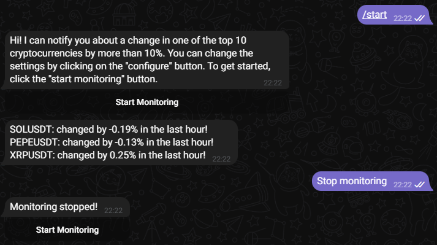

# crypto-monitoring

### Этот бот - мой учебный проект, реализованный с целью научиться работать с REST API. 

### На скриншоте ниже показана работа бота (для теста порог в 10% был заменен на более низкий)

 

#

* To-do:
  - Добавить БД
  - Добавить конфигурацию
  - Исопользовать разные API для улучшения точности выдачи
  
# 

#### 02.09.24 v 0.1